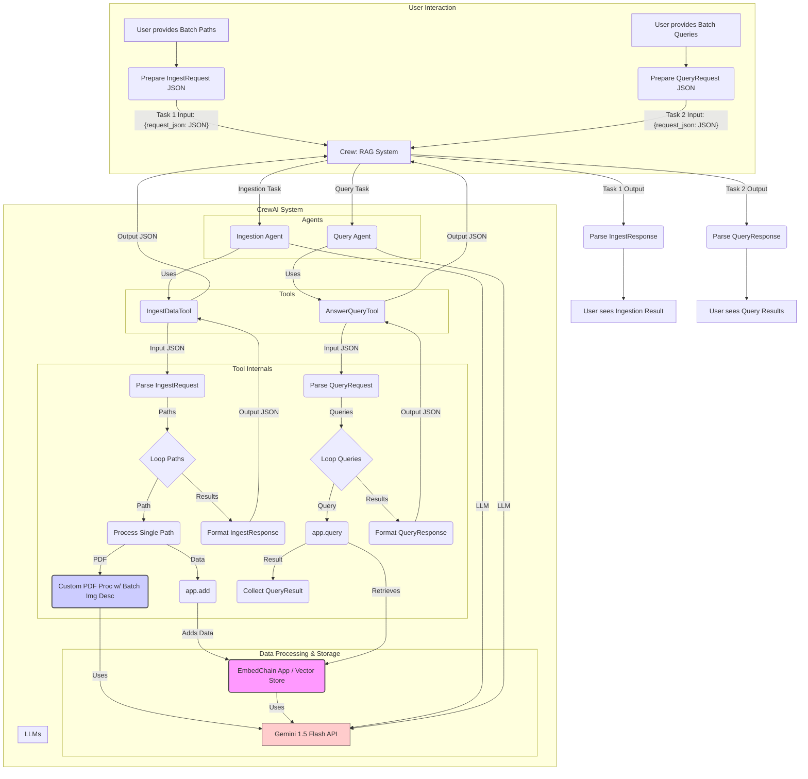

# Plan: Agentic RAG System with CrewAI, EmbedChain, Gemini Multimodal (Batch Processing & JSON/Pydantic)

**Goal:** Create a Python script (`rag_crew.py`) for an agentic RAG system using CrewAI and EmbedChain. The system will ingest documents (PDF, DOCX, TXT, MD) specified in a batch request, extract text and images from PDFs, generate descriptions for PDF images using Gemini 1.5 Flash (attempting batching), store text/descriptions with detailed metadata via EmbedChain, and answer a batch of queries using Gemini 1.5 Flash, providing sources. Communication between tools and agents will use JSON strings validated by Pydantic models.

**Revised Plan (v3):**

1.  **Project Setup:**
    *   Script file: `rag_crew.py`.
    *   Imports: `crewai` (Agent, Task, Crew, Process), `crewai_tools` (BaseTool), `embedchain` (App), `langchain_google_genai` (ChatGoogleGenerativeAI), `pymupdf` (fitz), `python-docx` (docx), `os`, `io`, `PIL` (Pillow), `pydantic` (BaseModel, Field), `json`, `typing` (List, Dict, Any).
    *   Environment Setup: Requires `GOOGLE_API_KEY` environment variable.

2.  **Pydantic Models:**
    *   Define data structures for requests and responses:
        ```python
        from pydantic import BaseModel, Field
        from typing import List, Dict, Any

        class IngestRequest(BaseModel):
            paths: List[str] = Field(..., description="List of file or folder paths to ingest.")

        class IngestResponse(BaseModel):
            status: str
            processed_files: List[str]
            errors: Dict[str, str] = Field(default_factory=dict, description="Dictionary mapping path to error message if processing failed.")

        class QueryResult(BaseModel):
            query: str
            answer: str
            sources: List[Dict[str, Any]] = Field(..., description="List of source nodes/metadata from EmbedChain.")

        class QueryRequest(BaseModel):
            queries: List[str] = Field(..., description="List of queries to answer.")

        class QueryResponse(BaseModel):
            results: List[QueryResult]
            errors: Dict[str, str] = Field(default_factory=dict, description="Dictionary mapping query to error message if answering failed.")
        ```

3.  **Custom PDF Processor:**
    *   Function `process_pdf(file_path, gemini_llm)`:
        *   Takes file path and the initialized `gemini-1.5-flash` model instance.
        *   Uses `pymupdf` (`fitz`) for text and image extraction per page.
        *   Collects all images from the PDF.
        *   Attempts to batch image description generation using the `gemini_llm` instance. Handle potential errors per image.
        *   Returns a list of data chunks (text and image descriptions) with metadata (`source`, `page_index`, `content_type`).

4.  **LLM & EmbedChain Initialization:**
    *   Initialize `gemini_llm = ChatGoogleGenerativeAI(model="gemini-1.5-flash-latest", google_api_key=os.environ["GOOGLE_API_KEY"])`.
    *   Initialize `app = App.from_config(...)` using `gemini_llm` and a Google embedder (e.g., `models/embedding-001`).

5.  **Tool Implementation (`crewai_tools.BaseTool`):**
    *   **`IngestDataTool`**:
        *   `name`: "Batch Document Ingestion Tool"
        *   `description`: "Accepts a JSON string representing an IngestRequest (list of paths). Processes each path, extracts data, stores in EmbedChain, and returns a JSON string representing an IngestResponse."
        *   `args_schema`: `IngestRequest`
        *   `_run(request_json: str)`:
            *   Parse `request_json` into `IngestRequest`. Handle errors.
            *   Iterate through `request.paths`, process files/folders (calling `process_pdf` etc.), use `app.add()` for data chunks.
            *   Collect results and errors.
            *   Create `IngestResponse` object.
            *   Return `response.model_dump_json()`.
    *   **`AnswerQueryTool`**:
        *   `name`: "Batch Query Answering Tool"
        *   `description`: "Accepts a JSON string representing a QueryRequest (list of queries). Answers each query using EmbedChain and returns a JSON string representing a QueryResponse."
        *   `args_schema`: `QueryRequest`
        *   `_run(request_json: str)`:
            *   Parse `request_json` into `QueryRequest`. Handle errors.
            *   Iterate through `request.queries`, call `app.query(query, citations=True)`.
            *   Collect results (`QueryResult`) and errors.
            *   Create `QueryResponse` object.
            *   Return `response.model_dump_json()`.

6.  **Agent Definition:**
    *   `ingestion_agent = Agent(...)`: Goal: "Efficiently process a *batch* of documents specified in a JSON request..." LLM: `gemini_llm`, Tool: `IngestDataTool`.
    *   `query_agent = Agent(...)`: Goal: "Answer a *batch* of queries specified in a JSON request..." LLM: `gemini_llm`, Tool: `AnswerQueryTool`.

7.  **Task Definition:**
    *   `ingestion_task = Task(...)`: Description: "Process the batch document ingestion request: {request_json}. Use the Ingestion Tool..." Expected Output: "A JSON string summarizing the ingestion results (IngestResponse schema)." Agent: `ingestion_agent`.
    *   `query_task = Task(...)`: Description: "Process the batch query request: {request_json}. Use the Query Answering Tool..." Expected Output: "A JSON string containing query results (QueryResponse schema)." Agent: `query_agent`.

8.  **Crew Definition:**
    *   `rag_crew = Crew(...)`: Agents: [`ingestion_agent`, `query_agent`], Tasks: [`ingestion_task`, `query_task`], Process: `Process.sequential`.

9.  **Execution Logic & Example Usage:**
    *   `if __name__ == "__main__":` block.
    *   Create example `IngestRequest` and `QueryRequest` objects.
    *   Convert to JSON: `ingest_json = ingest_request.model_dump_json()`, `query_json = query_request.model_dump_json()`.
    *   Instantiate Crew.
    *   Run ingestion: `ingestion_result_json = crew.kickoff(inputs={'request_json': ingest_json})` (assuming task 1 uses this input key).
    *   Parse `ingestion_result_json` to `IngestResponse`. Print results.
    *   Run querying: `query_result_json = crew.kickoff(inputs={'request_json': query_json})` (assuming task 2 uses this input key, might need separate crew or adjusted kickoff).
    *   Parse `query_result_json` to `QueryResponse`. Print results.

10. **Dependencies & Notes:**
    *   `requirements.txt`:
        ```
        crewai
        crewai_tools
        embedchain[google,pdf,docx]
        langchain-google-genai
        PyMuPDF
        Pillow
        python-docx
        pydantic
        ```
    *   Note about `GOOGLE_API_KEY` and API costs.

**Mermaid Diagram (Conceptual):**

